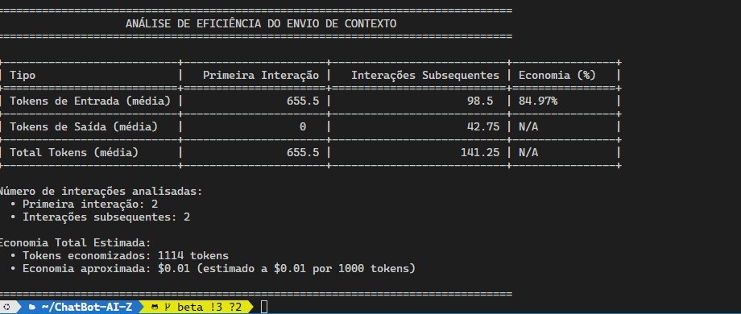

# ChatBot-AI-Z 🍔

Um chatbot de atendimento para hamburgueria usando a API da OpenAI.

## Pré-requisitos

- Python 3.8 ou superior
- Uma conta na OpenAI com chave de API válida

## Configuração do Ambiente

1. Clone o repositório:

```bash
git clone https://github.com/seu-usuario/ChatBot-AI-Z.git
cd ChatBot-AI-Z
```

2. Crie um ambiente virtual (recomendado):

```bash
python -m venv venv
```

# No Windows:
```bash
venv\Scripts\activate
```

# No Linux/Mac:
```bash
source venv/bin/activate
```

3. Instale as dependências:

```bash
pip install -r requirements.txt
```

4. Crie um arquivo `.env` na raiz do projeto com sua chave da API da OpenAI:

```
OPENAI_API_KEY=sua_chave_api_aqui
```

## Como Usar

1. Ative o ambiente virtual (caso não esteja ativado):

```bash
# No Windows:
venv\Scripts\activate

# No Linux/Mac:
source venv/bin/activate
```

2. Execute o chatbot:

```bash
python chatbot.py
```

3. Interaja com o chatbot:

- Digite "cardápio" para ver as opções disponíveis
- Digite "limpar" para começar uma nova conversa
- Digite "sair" para encerrar o programa

### Recursos do Chatbot

- Atendente virtual de uma hamburgueria que oferece:
  - Diversos tipos de hambúrgueres
  - Snacks e acompanhamentos
  - Bebidas
- Pode mostrar o cardápio completo quando solicitado
- Processa pedidos e formas de pagamento (cartão ou PIX)
- Gera um resumo estruturado do pedido ao final da interação

## Observações

- O chatbot está limitado a 3 interações antes de mostrar o resumo do pedido
- O sistema utiliza o modelo GPT-4 da OpenAI
- É necessário ter uma chave de API válida da OpenAI para funcionar

# Chatbot Hamburgueria Z - Versão Web (Branch Beta)

Esta branch contém a versão web do chatbot da Hamburgueria Z, implementada com Flask.

## Diferenças da Branch Main

- Interface web completa com Flask
- Design responsivo com CSS
- Mesma lógica de negócios adaptada para ambiente web
- Facilidade de uso através do navegador

## Requisitos

- Python 3.8+
- Bibliotecas listadas em requirements.txt

## Instalação

1. Clone o repositório e mude para a branch beta

```bash
git clone <URL_DO_SEU_REPOSITORIO>
cd ChatBot-AI-Z
git checkout beta
```

2. Crie e ative um ambiente virtual

```bash
python -m venv venv
source venv/bin/activate  # No Windows: venv\Scripts\activate
```

3. Instale as dependências

```bash
pip install -r requirements.txt
```

4. Configure as variáveis de ambiente
   Crie um arquivo .env na raiz do projeto com:

```
OPENAI_API_KEY=sua_chave_da_api_da_openai
SECRET_KEY=chave_secreta_para_flask
```

## Execução

Para iniciar o servidor Flask:

```bash
python app.py
```

Acesse a aplicação em http://localhost:5000

## Estrutura do Projeto

- `app.py`: Aplicação Flask principal
- `chatbot.py`: Módulo com a lógica do chatbot
- `static/`: Arquivos estáticos (CSS, JavaScript)
- `templates/`: Templates HTML
- `utils/`: Módulos utilitários

## Atualizações futuras

- Contabilizacão de tokens via debug e extração completa de estatisticas
- Redução do consumo de tokens ao não enviar o contexto todas as vezes para a OpenAI.
- Otimização do código

## Screenshots

[Insira screenshots da aplicação web aqui]
